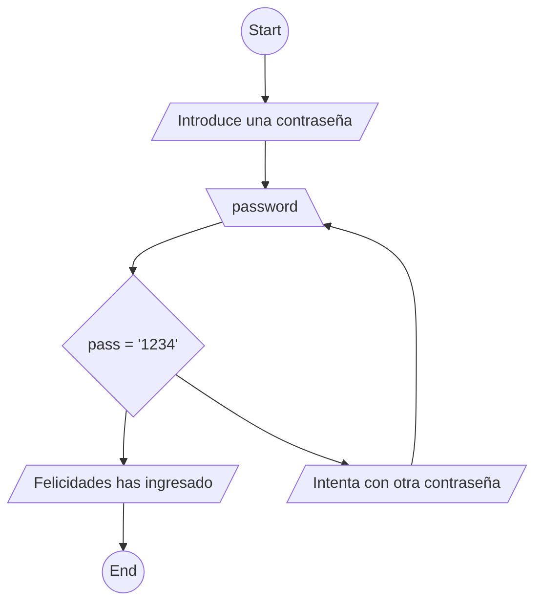

# Diagrama de flujo

```mermaid
  graph TD;
      A((Start))
      B[/Introduce una contraseña/]
      C[\password\]
      D{pass = '1234'}
      E[/Felicidades has ingresado/]
      F[/Intenta con otra contraseña/]
      G((End))

      A-->B-->C-->D
      D-->E
      D-->F
      F-->C
      E-->G
```